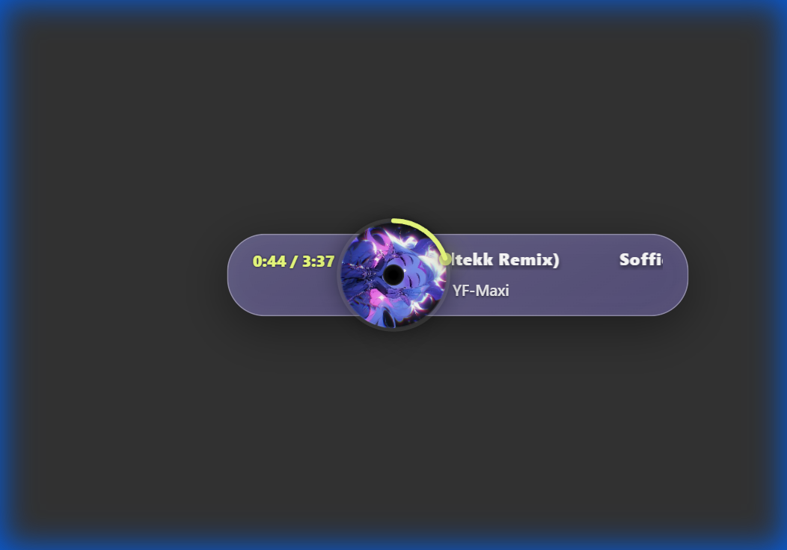
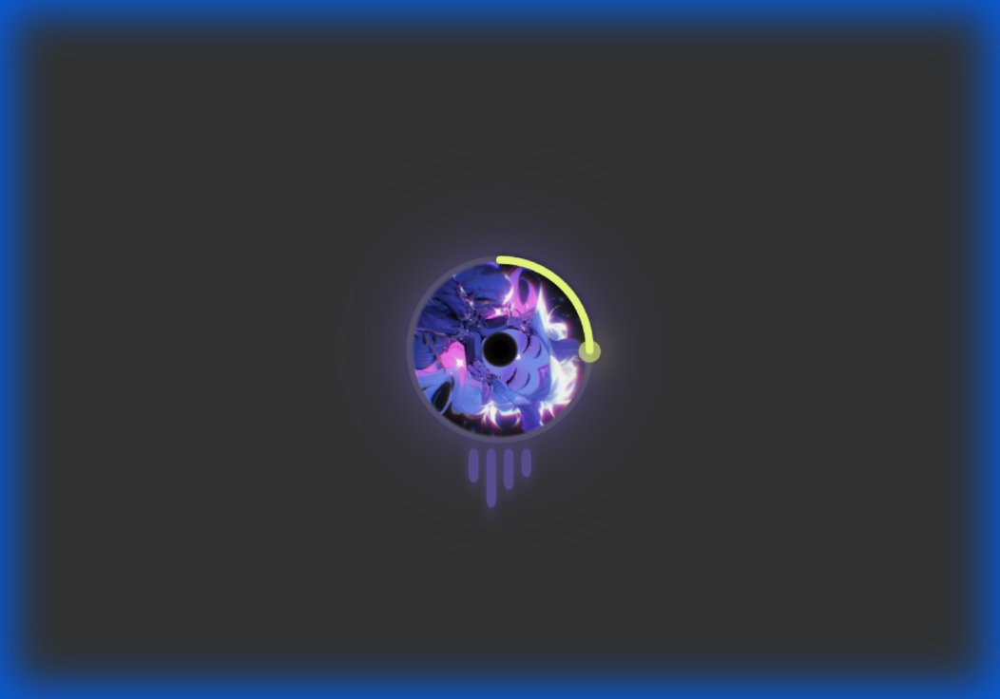
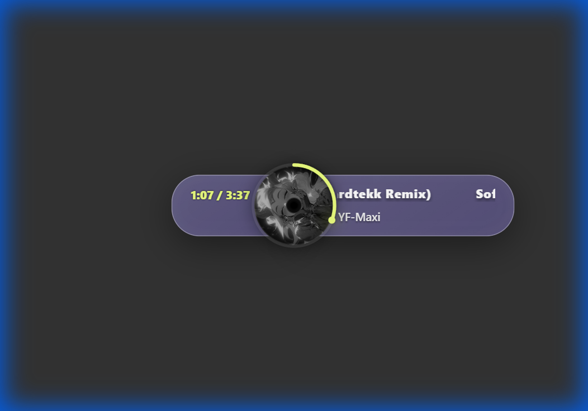

# 🎵 Music Overlay für OBS

Ein schönes, animiertes Musik-Overlay für deine Streams! Zeigt den aktuell spielenden Song mit Cover, Titel, Künstler und Fortschrittsanzeige.

## ✨ Features

- 🎨 **Dynamische Farben** - Passt sich automatisch an das Album-Cover an
- 🎬 **Coole Animationen** - 10+ Eingangs-Animationen für Song-Wechsel
- 📱 **Responsive** - Skaliert automatisch auf jede Größe
- 🔄 **Multi-Source Support** - YouTube Music, Spotify, VLC, foobar2000, Streamerbot
- 💬 **Twitch Chat** - !song Befehl zeigt den aktuellen Song
- ⏸️ **Auto-Hide** - Minimiert sich automatisch wenn pausiert

---

## 📸 Preview

Hier siehst du, wie das Overlay in verschiedenen Situationen aussieht:

| **Full UI (Playing)** | **Compact UI (Idle)** | **Paused** |
|:---:|:---:|:---:|
|  |  |  |

---

## 🚀 Quick Start

### Schritt 1: Musik-App wählen

| Ich nutze... | Dann installiere... |
|--------------|---------------------|
| **YouTube Music** | [th-ch YouTube Music App](https://github.com/th-ch/youtube-music/releases) (empfohlen) |
| **YouTube Music** (Alternative) | [YouTube Music Desktop App](https://ytmdesktop.app/) |
| **Spotify** | **Native Integration** (Start `setup.html`) oder **Last.fm** (Alternative) |
| **Apple Music** | [Cider](https://cider.sh/) |
| **VLC Media Player** | [VLC Media Player](https://www.videolan.org/vlc/) |
| **foobar2000** | [foobar2000](https://www.foobar2000.org/) + [Beefweb](https://github.com/hyperion-project/beefweb) |
| **Streamerbot** | [Streamer.bot](https://streamer.bot/) (für Fortgeschrittene) |

> 💬 **Twitch Chat Support:** Egal welche Musikquelle - mit dem [Twitch Chat Setup](#twitch-chat-setup) können deine Zuschauer `!song` schreiben um den aktuellen Song zu sehen!

> ⚠️ **Deezer & Amazon Music:** Diese Dienste haben leider keine lokalen APIs. Nutze alternativ [VLC](#vlc-media-player-setup) oder [foobar2000](#foobar2000-setup) für lokale Dateien.

### Schritt 2: Overlay in OBS einrichten

1. In OBS: **Quellen** → **+** → **Browser**
2. **Lokale Datei** aktivieren
3. Pfad zur `index.html` wählen (z.B. `D:\CODE\Music-Overlay\index.html`)
4. Empfohlene Größe:
   - **Breite:** `800` (oder 100% der Szene)
   - **Höhe:** `150` (Minimum: `120`)
5. **OK** klicken

### Schritt 3: Musik abspielen

Starte deine Musik-App und spiele einen Song ab. Das Overlay sollte sich automatisch verbinden! 🎉

---

## 📱 YouTube Music (th-ch) - EMPFOHLEN

Die **th-ch YouTube Music App** ist die beliebteste Desktop-App für YouTube Music mit eingebautem API Server.

### Installation

**Option A: Mit winget (empfohlen)**
```powershell
winget install th-ch.YouTubeMusic
```

**Option B: Manueller Download**
1. Gehe zu [github.com/th-ch/youtube-music](https://github.com/th-ch/youtube-music/releases)
2. Lade die neueste `.exe` herunter
3. Installieren und starten

### API Server aktivieren

1. Öffne die App und klicke auf das **Burger-Menü** (3 Striche)
2. Gehe zu **Plugins**
3. Aktiviere **"API Server (BETA)"**
4. In den Plugin-Einstellungen:
   - **Authorization**: Auf "No Authorization" setzen
   - Port merken (Standard: `26538`)

```
✅ API Server läuft auf: http://localhost:26538
```

### Fertig!

Öffne das Overlay in OBS und spiele Musik ab. Das Overlay verbindet sich automatisch!

---

## 📱 YouTube Music Desktop App (Alternative)

Alternative App von [ytmdesktop.app](https://ytmdesktop.app/).

### Installation

1. **Download** von [ytmdesktop.app](https://ytmdesktop.app/)
2. **Installieren** und starten
3. Mit deinem Google-Konto **anmelden**

### Companion Server aktivieren

1. Öffne die **Einstellungen** (Zahnrad-Symbol)
2. Gehe zu **Integrations**
3. Aktiviere **"Enable Companion Server"**
4. **Authentifizierung deaktivieren** (einfacher)

```
✅ Companion Server läuft auf: http://localhost:9863
```

---

```
✅ Companion Server läuft auf: http://localhost:9863
```

---

## 🎵 Option 2: Last.fm (Empfohlene Alternative)

Da Spotify die Erstellung neuer Developer-Apps pausiert hat, ist **Last.fm** die stabilste Lösung für alle neuen Nutzer.

### 1. Account erstellen
Erstelle einen kostenlosen Account auf [Last.fm](https://www.last.fm/).

### 2. Spotify verbinden
Gehe in deine [Last.fm Anwendungen](https://www.last.fm/settings/applications) und klicke auf **"Spotify Scrobbling verbinden"**. Jetzt "hört" Last.fm alles, was du auf Spotify hörst.

### 3. API Key holen
1. Gehe zu: [Last.fm API Account erstellen](https://www.last.fm/api/account/create)
2. Fülle irgendwas ein (z.B. Name: "Overlay", Beschreibung: "My Overlay").
3. Klicke Submit.
4. Kopiere den **"API Key"**.

### 4. Im Overlay eintragen
1. Öffne die `setup.html` im Overlay-Ordner.
2. Klicke oben auf den Tab **"Last.fm (Alternative)"**.
3. Trage deinen **Last.fm Benutzernamen** und den **API Key** ein.
4. Klicke "Save".

Das Overlay zeigt nun deine Musik von Last.fm an. (Mit ca. 2-3 Sekunden Verzögerung).


---

> ℹ️ **Last.fm Hinweise:**
> - **Zeitleiste & Progress Bar:** Werden ausgeblendet, da Last.fm keine Live-Position liefert.
> - **Auto-Hide:** Funktioniert auch hier! Sobald Last.fm den Song nicht mehr als "Now Playing" meldet (wenn du stoppst), startet der Timer und das Overlay verschwindet.

---

## 🤖 Streamerbot Setup (Fortgeschritten)

Falls du bereits **Streamerbot** für deine Streams nutzt, kannst du das Overlay auch darüber steuern.

### WebSocket Server aktivieren

1. Öffne Streamerbot
2. Gehe zu **Servers/Clients** → **WebSocket Server**
3. Aktiviere den Server auf Port **8080**

### Action einrichten

1. Erstelle eine neue **Action** namens "MusicUpdate"
2. Füge einen **C# Code** Subaction hinzu
3. Kopiere den Code aus `StreamerbotSongCommand.cs`
4. Verbinde die Action mit deinem Music-Trigger (z.B. YouTube Music Integration)

```
✅ WebSocket läuft auf: ws://localhost:8080
```

---

## � Apple Music (Cider) Setup

**Cider** ist ein Open-Source Apple Music Client mit eingebauter API.

### Installation

**Option A: Cider Classic (kostenlos)**
- Download von [cider.sh](https://cider.sh/) oder [GitHub](https://github.com/ciderapp/Cider/releases)

**Option B: Cider 2 (kostenpflichtig, aber besser)**
- Verfügbar auf [itch.io](https://cidercollective.itch.io/cider)

### API aktivieren

1. Öffne Cider
2. Gehe zu **Settings** → **Connectivity**
3. Aktiviere **External Application Access**
4. Optional: Generiere einen **API Token** (oder deaktiviere Token-Anforderung)

### In config.js eintragen (falls Token aktiv)

```javascript
const CIDER_URL = 'http://localhost:10767';
const CIDER_API_TOKEN = 'dein_token';  // Leer lassen wenn deaktiviert
```

```
✅ Cider API läuft auf: http://localhost:10767
```

---

## �🎬 VLC Media Player Setup

VLC hat ein eingebautes HTTP Interface für externe Kontrolle.

### HTTP Interface aktivieren

1. Öffne VLC
2. Gehe zu **Tools** → **Preferences**
3. Zeige **Alle** Einstellungen (unten links)
4. Navigiere zu **Interface** → **Main interfaces**
5. Aktiviere **Web**
6. Gehe zu **Interface** → **Main interfaces** → **Lua**
7. Setze ein **HTTP Password** (merken!)
8. Starte VLC neu

### In config.js eintragen

```javascript
const VLC_URL = 'http://localhost:8080';
const VLC_PASSWORD = 'dein_passwort';  // Das Passwort von Schritt 7
```

```
✅ HTTP Interface läuft auf: http://localhost:8080
```

---

## 🎵 foobar2000 Setup

foobar2000 benötigt das **Beefweb** Plugin für die API.

### Beefweb installieren

1. Öffne foobar2000
2. Gehe zu **File** → **Preferences** → **Components**
3. Klicke **Install...** und suche nach **Beefweb**
4. Installieren und foobar2000 neu starten

Oder manuell von: [github.com/hyperblast/beefweb](https://github.com/hyperblast/beefweb/releases)

```
✅ Beefweb API läuft auf: http://localhost:8880
```

---

## 💬 Twitch Chat Setup

Mit Twitch Chat können deine Zuschauer `!song` schreiben und das Widget zeigt den aktuellen Song!

### Einrichtung

Öffne `js/config.js` und trage deinen Kanal ein:

```javascript
// Dein Twitch Kanal-Name (ohne #)
const TWITCH_CHANNEL = 'dein_username';
```

Das war's! **Kein OAuth Token nötig** - das Overlay verbindet sich anonym (nur lesen).

### Verfügbare Befehle

| Befehl | Funktion |
|--------|----------|
| `!song` | Zeigt aktuellen Song |
| `!music` | Zeigt aktuellen Song |
| `!np` | Zeigt aktuellen Song (Now Playing) |
| `!nowplaying` | Zeigt aktuellen Song |

> 💡 **Tipp:** Twitch Chat läuft **parallel** zur Musikquelle. Du kannst beides gleichzeitig nutzen!

---

## ⚙️ Konfiguration

Die Konfiguration erfolgt über die Datei `js/config.js`:

```javascript
// === MUSIK-QUELLE ===
// 'youtube-thch' - th-ch YouTube Music App (empfohlen)
// 'youtube'      - YouTube Music Desktop App (ytmdesktop.app)
// 'spotify'      - Native Integration or Last.fm
// 'vlc'          - VLC Media Player
// 'foobar'       - foobar2000
// 'streamerbot'  - Streamerbot WebSocket
// 'auto'         - Automatische Erkennung (Standard)
const MUSIC_SOURCE = 'auto';
```

### Verfügbare Optionen

| Option | Beschreibung |
|--------|-------------|
| `MUSIC_SOURCE` | Welche Musikquelle verwendet werden soll |
| `AUTO_HIDE_DURATION` | Zeit in ms bis sich das Overlay minimiert (Standard: 30000) |
| `USE_PHYSICS_ANIMATION` | Aktiviert die physik-basierten Animationen |
| `DEBUG_MODE` | Zeigt zusätzliche Logs in der Konsole |

---

## 🎨 Anpassung

### Overlay-Größe ändern

In OBS kannst du die Browser-Source einfach skalieren. Das Overlay passt sich automatisch an.

Für feste Größen, ändere in `css/main.css`:

```css
#widget-wrapper {
    /* Deine gewünschte Größe */
    width: 800px;
    height: 150px;
}
```

### Farben anpassen

Das Overlay nutzt automatisch die dominante Farbe des Album-Covers. Für eigene Farben, bearbeite `css/main.css`:

```css
:root {
    --pill-bg: rgba(26, 26, 46, 0.85);
    --text-color: #ffffff;
}
```

---

## 🔧 Troubleshooting

### Das Overlay zeigt "Suche Musik-Quellen..."

- **Ist deine Musik-App gestartet?**
- **th-ch App**: Ist der API Server aktiviert? (Plugins → API Server)
- **YouTube Music Desktop**: Ist der Companion Server aktiviert?
- **Spotify**: Ist setup.html erfolgreich durchgelaufen?
- **Streamerbot**: Ist der WebSocket Server auf Port 8080 aktiv?

### Das Overlay verbindet sich, zeigt aber keine Musik

- Spiele einen Song ab (nicht pausiert)
- Bei YouTube Music: Manchmal dauert es 1-2 Sekunden

### Cover-Bild wird nicht angezeigt

- Das Album muss ein Cover-Bild haben
- Bei lokalen Dateien: Cover muss eingebettet sein

### Overlay erscheint nicht in OBS

1. Prüfe ob der Pfad zur `index.html` korrekt ist
2. Rechtsklick auf Browser-Source → **Interagieren** (zum Debuggen)
3. Drücke F12 für DevTools und prüfe die Konsole

---

## 📁 Dateistruktur

```
Music-Overlay/
├── index.html              # Haupt-HTML-Datei
├── README.md               # Diese Dokumentation
├── css/
│   └── main.css            # Alle Styles
├── js/
│   ├── config.js           # Konfiguration
│   ├── main.js             # Hauptlogik
│   ├── dom.js              # DOM-Referenzen
│   ├── state.js            # Globaler State
│   ├── features/
│   │   ├── animation.js    # Animationen
│   │   └── ui.js           # UI-Updates
│   ├── services/
│   │   ├── source-manager.js   # Quellen-Management
│   │   ├── youtube-music.js    # YT Music Connector
│   │   ├── spotify.js          # Spotify Connector
│   │   └── streamerbot.js      # Streamerbot Connector
│   └── utils/
│       ├── colors.js       # Farbfunktionen
│       ├── helpers.js      # Hilfsfunktionen
│       └── debug.js        # Debug-Funktionen
└── Streamerbot*.cs         # Streamerbot-Scripts
```

---


## 📄 Lizenz

MIT License - Frei nutzbar für private und kommerzielle Streams!
